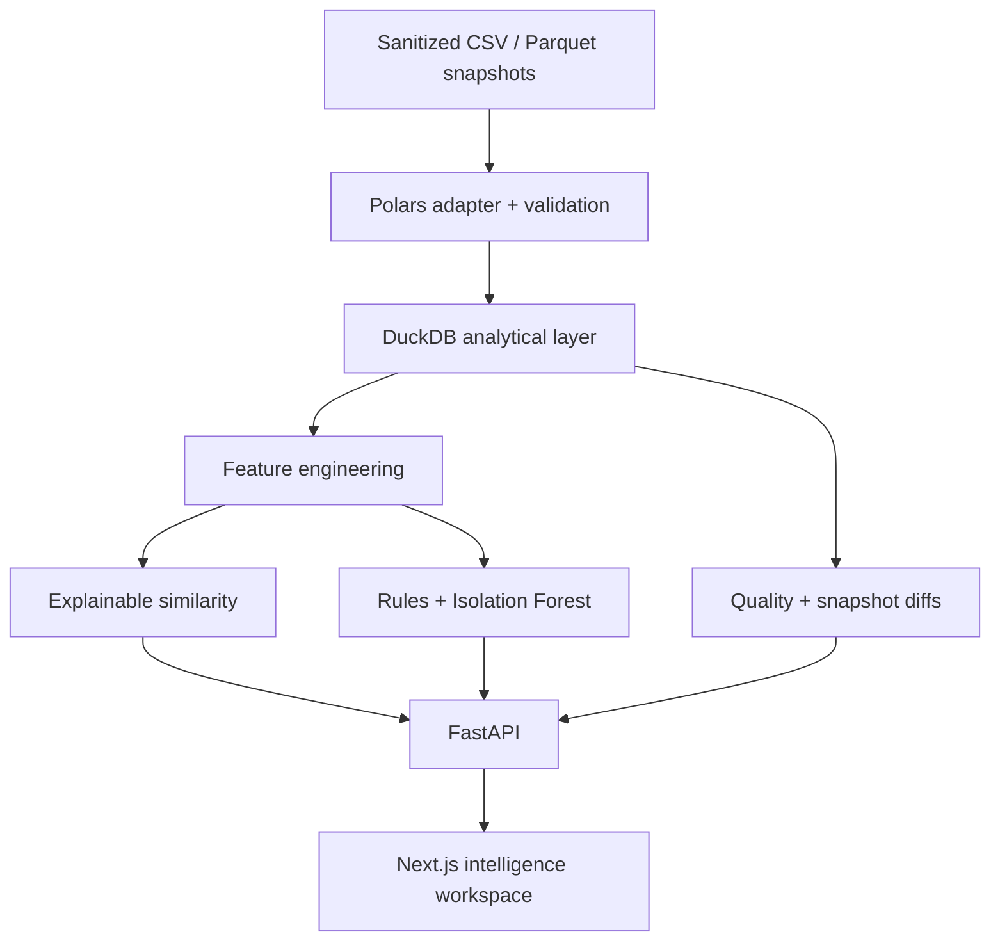

# ETF Intelligence Lab

> Explore, compare and audit ETF datasets through explainable similarity search, anomaly detection, data observability, and lineage.

ETF Intelligence Lab is a standalone, deployment-ready portfolio project that turns sanitized ETF snapshots into an institutional-style intelligence workspace. It demonstrates financial-data engineering, typed APIs, analytical SQL, explainable ML, deterministic data quality, and a polished Next.js product experience—without depending on or exposing the private data producer.

**Live demo:** not published (local-only handoff) · **API docs:** `http://localhost:8000/docs`

> **Demo data notice:** the repository ships only deterministic synthetic records. Values are for product demonstration, not investment analysis or advice.

## Product preview

Add the final deployed captures listed in [`docs/screenshots/README.md`](docs/screenshots/README.md). The highest-value portfolio views are the command center, explainable ETF detail, similarity map, observability view, and dataset diff.

## The 60-second product tour

1. Open `/dashboard` and scan dataset health, reported AUM, exchange coverage, provider reliability, and automated insights.
2. Click **Find similar ETFs** to inspect the graph and contribution-level similarity explanation.
3. Open a flagged ETF to review its anomaly, provenance, normalized record, and per-dimension quality score.
4. Visit `/observability` for provider reliability, then `/history` for a Git-style snapshot diff.
5. Press <kbd>Ctrl</kbd>/<kbd>Cmd</kbd> + <kbd>K</kbd> to search any ETF or route.

## Features

- Premium landing page and dense data command center.
- Paginated ETF explorer with full-text search, filters, sorting, chips, and column visibility.
- ETF detail pages with listings, fund characteristics, similar ETFs, anomalies, provenance, and raw normalized records.
- Explainable similarity graph with AUM-sized nodes, weighted edges, threshold and issuer filters, recentering, and score contributions.
- Two-to-five ETF comparison with automatic difference markers and deterministic narrative summaries.
- Deterministic quality rules plus Isolation Forest anomaly signals with human-readable context.
- Data observability with provider reliability, freshness, completeness, validity, uniqueness, and historical health.
- Dataset time travel across three demo snapshots with additions, removals, and field-level changes.
- Lightweight data lineage from sanitized source record to normalized ETF entity and analytical output.
- Local data copilot that maps questions to safe deterministic tools; no API key or dataset upload required.
- Dark/light presentation, responsive layouts, and Cmd/Ctrl + K command palette.

## Architecture



The frontend ships a small synthetic local fallback for resilient portfolio previews. When FastAPI is reachable, the status indicator confirms the live DuckDB snapshot. The backend is the authoritative analytical implementation and exposes paginated, filterable contracts.

Read the full decisions in [`docs/ARCHITECTURE.md`](docs/ARCHITECTURE.md) and the source audit in [`docs/DATA_DISCOVERY.md`](docs/DATA_DISCOVERY.md).

## Tech stack

| Layer | Technology |
| --- | --- |
| Product UI | Next.js App Router, React, TypeScript, Tailwind CSS |
| Interaction | TanStack Table, Recharts, Lucide, lightweight SVG network |
| API | FastAPI, Pydantic, dependency injection |
| Data | Polars-ready adapter, DuckDB, CSV/Parquet-compatible model |
| ML | scikit-learn TF-IDF, NumPy, Isolation Forest, cosine-style weighted similarity |
| Quality | deterministic validation, transparent weighted scores |
| Delivery | Docker Compose, GitHub Actions, Vercel + Render/Railway/Fly-ready |

## Engineering highlights

- **DuckDB analytical queries:** normalized ETF and listing tables, indexed ISIN lookup, backend filtering, aggregates, and multi-snapshot comparisons without an external database.
- **Polars ETL:** a public allowlist adapter accepts both discovered 14- and 15-column aggregate variants and never infers missing AUM currency.
- **Explainable ETF similarity:** TF-IDF text similarity, categorical matches, set overlap, and numeric proximity return contributions that sum to the final score.
- **Deterministic + ML anomalies:** actionable rules lead; Isolation Forest adds only a secondary unusual-profile signal and names the most unusual feature.
- **Snapshot diffing:** entity and listing changes are computed from immutable dated snapshots, with coverage deltas and field-level before/after values.
- **Provider observability:** an explicit reliability formula combines completeness, freshness, consistency, uniqueness, validity, and anomaly rate.
- **Data lineage:** detail pages expose source label, snapshot, normalization, and validation state without leaking upstream URLs or paths.
- **LLM-safe query design:** the mock copilot calls deterministic functions such as `search_etfs`, `find_similar`, and `get_provider_quality`; no entire dataset is sent to an LLM.

## Similarity methodology

The score combines semantic characteristics (25%), asset class (20%), benchmark (13%), category (12%), currency (8%), exchange overlap (7%), AUM scale (7%), issuer (5%), and age (3%). Missing values contribute zero. See [`docs/ML_METHODS.md`](docs/ML_METHODS.md) for formulas and determinism details.

## Anomaly and data-quality methodology

The validation layer checks ISIN checksums, AUM types and ranges, ISO currencies, dates, duplicates, freshness, and listing coverage. ETF quality is a weighted 0–100 score across identifier, AUM, listings, freshness, consistency, and source confidence. These scores measure **data quality**, never fund quality or expected returns.

## Repository structure

```text
backend/app/
  api/ analytics/ core/ data_quality/ ml/ repositories/ schemas/ services/
backend/tests/               deterministic unit and API tests
frontend/app/                route-level product surfaces
frontend/components/         dashboard, explorer, graph, compare, observability
frontend/lib/                API client and synthetic fallback analytics
data/snapshots/              generated synthetic dated snapshots
scripts/                     demo generator and sanitizing import adapter
docs/                        discovery, architecture, ML and deployment
.github/workflows/ci.yml     lint, test, type-check and build
```

## Quick start

### Local development (recommended — no Docker)

Docker is optional. The simplest Windows test path uses two PowerShell terminals.

First terminal:

```powershell
python -m venv .venv
.\.venv\Scripts\Activate.ps1
python -m pip install -r backend\requirements.txt
python scripts\generate_demo_dataset.py
python scripts\build_parquet.py
cd backend
uvicorn app.main:app --reload
```

Second terminal:

```powershell
cd frontend
Copy-Item .env.example .env.local -ErrorAction SilentlyContinue
npm ci
npm run dev
```

Open:

- Product: `http://localhost:3000`
- API health: `http://localhost:8000/health`
- Interactive OpenAPI docs: `http://localhost:8000/docs`

Python 3.14 and Node 22 are the primary tested runtimes. If PowerShell blocks virtual-environment activation, run `Set-ExecutionPolicy -Scope Process Bypass` in that terminal, then activate again.

### Docker (optional)

Only use this after Docker Desktop reports a healthy Linux engine with `docker info`.

```powershell
python scripts\generate_demo_dataset.py
python scripts\build_parquet.py
docker compose up --build
```

The application does not require Docker for development or testing.

## API examples

```bash
curl http://localhost:8000/health
curl "http://localhost:8000/api/etfs?asset_class=Equity&min_aum=1000&page=1&page_size=25"
curl http://localhost:8000/api/etfs/IE1000000663/similar
curl "http://localhost:8000/api/compare?isins=IE1000000663,IE1000001249"
curl "http://localhost:8000/api/history/diff?from_date=2026-08-14&to_date=2026-08-28"
```

Core routes include `/api/stats`, `/api/etfs`, `/api/etfs/{isin}`, `/similar`, `/anomalies`, `/api/providers`, `/api/compare`, `/api/history`, `/api/network/{isin}`, `/api/lineage/{isin}`, and `/api/copilot`.

## Tests and quality gates

```bash
cd backend
ruff check app tests
pytest -q --cov=app

cd ../frontend
npm run lint
npm run type-check
npm test
npm run build
```

GitHub Actions runs the same checks on push and pull request.

## Deployment

- Deploy `frontend/` to Vercel and set `NEXT_PUBLIC_API_URL`.
- Deploy the root-context `backend/Dockerfile` to Render, Railway, or Fly.io.
- Set `ETF_LAB_CORS_ORIGINS` to the frontend origin.
- No PostgreSQL, Supabase, or paid vector database is required.

Exact steps and the release safety checklist are in [`docs/DEPLOYMENT.md`](docs/DEPLOYMENT.md).

## Privacy and data disclaimer

This repository is independent from the system that produced the original ETF aggregates. It contains no scraper implementation, upstream authentication, private URLs, internal client information, or proprietary infrastructure. The import adapter only accepts explicit exported files and drops non-allowlisted fields. Review every real snapshot before publication.

The generated records, providers, and metrics are fictional and clearly labelled synthetic. Nothing in this application is investment advice.

## Original context

The product was inspired by experience building financial-data ingestion and quality systems. The portfolio application, normalized model, analytical services, UI, and demonstration dataset are standalone work. It does not require, reproduce, or publish a private scraping implementation.

## Limitations

- No price, return, NAV, holdings, risk, flow, ESG, or benchmark-constituent history is available.
- Reported AUM is not converted across currencies; aggregate views are explicitly labelled.
- Imported fund age falls back to earliest known listing date when inception date is unavailable.
- Historical diffs identify changes but cannot infer whether the cause is economic or source-related.
- The default graph is optimized for a nearest-neighbor neighborhood, not the entire ETF universe.
- Local copilot intentionally supports bounded analytical intents rather than arbitrary SQL.

## Future work

- Add approved price/NAV history for tracking-error and drawdown analysis.
- Add a sentence-transformer adapter behind the same explainable contribution interface.
- Persist analyst annotations in Postgres only when multi-user collaboration is needed.
- Add contract tests against a separately published public Parquet schema.
- Export shareable comparison and data-quality reports.

## License

Choose a license only after confirming the portfolio and data-publication policy that applies to your work. No license is asserted by default.
